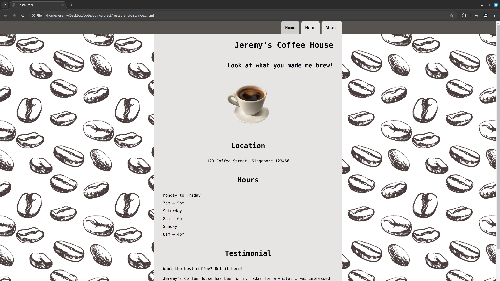
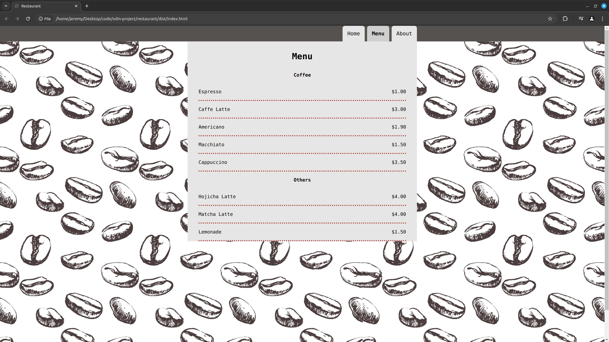
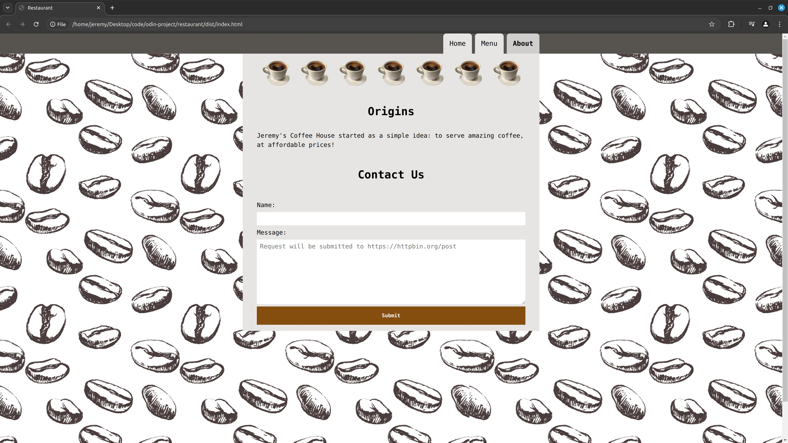

# Project: Restaurant Page (JavaScript Course)

Continue practicing DOM manipulation by dynamically rendering a restaurant homepage. By the end, we are going to be using JavaScript alone to generate the entire contents of the website

https://www.theodinproject.com/lessons/node-path-javascript-restaurant-page

**Note: DOM elements should be created using JavaScript but styling can be done in a separate CSS file**

# Screenshots of completed project




# References

- Loading Images with Webpack - https://webpack.js.org/guides/asset-management/#loading-images
- Coffee Cup Image from Freepik - https://www.freepik.com/free-vector/realistic-cup-black-brewed-coffee-saucer-vector-illustration_23128948.htm#fromView=search&page=1&position=24&uuid=a53baf14-a032-4d83-8393-b071da427e28 
- Background Image from Freepik - https://www.freepik.com/free-vector/hand-drawn-coffee-bean-drawing-pattern_52805492.htm#fromView=image_search_similar&page=1&position=39&uuid=fc6d9f2b-eb49-4ff8-8ad7-e0db43535e16
  

# Building project with webpack
Run command `npm run build:watch` and open the `dist/index.html` file in the browser


## .gitignore file
```
.gitignore

When working with packages that are installed with npm, you don't need to track the contents of "node_modules" with git, nor push these changes to GitHub

The "package.json" contains all of the information, so anyone can clone your project and install them on their machine using "npm install"

We can make a ".gitignore" file in the root of the project, and by writing file or directory names in it, we can tell git what files to ignore

"node_modules" can get very big, so we will add it to ".gitignore"
 ```

# Assignment
1) Start the project the same way you began the webpack tutorial project
    1) Run `npm init` in project directory to generate a `package.json` file
    2) Run `npm install webpack webpack-cli --save-dev` to install webpack to the node_modules directory of your project
    3) Create a `src` and `dist` directory with the following contents:
        
        1) An `index.js` file in `src`
        2) An `index.html` file in `src`. This file will not need a script tag, because we will use `html-webpack-plugin`, which automatically adds that in. You will not need to link a CSS stylesheet as you should be improting it into your JavaScript and letting your webpack configuration handle bundling
        3) Create a `webpack.config.js` file that looks like your file from the [Webpack "Getting Started" tutorial](https://webpack.js.org/guides/getting-started/#using-a-configuration). Add the `html-webpack-plugin` to your `webpack.config.js` and set the `template` option with a path to `src/index.html`  
2) Create a `.gitignore` file in the root of your project. It should contain `node_modules` and `dist` on separate lines
3) Set up an HTML skeleton insie of `src/index.html`. Inside the body, add a `<header>` element that contains a `<nav>` with buttons (not links!) for different "tabs" (e.g. buttons for "Home", "Menu" or "About" etc). Below the `<header>`, add a single `<div id="content">`
4) Inside of `src/index.js` write a `console.log` or `alert` statement and then run `npx webpack`. Load up `dist/index.html` in a browser and make sure everything is working correctly. (If you run `npx webpack --watch` you will not have to rerun webpack every time you make a change)
5) Inside `div#content`, create a homepage for your restaurant. You might want to include an image, headline, and some text about how wonderful the restaurant is; you do not have to make this look too fancy. It’s okay to hard-code these into the HTML for now just to see how they look on the page.
6) Now remove everything inside `div#content` from the HTML (so you still have the `<header>` and `<nav>` with an empty `<div id="content">` below it) and instead create them by using JavaScript only, e.g. by appending each new element to `div#content` once the page is first loaded. Since we’re all set up to write our code in multiple files, let’s write this initial page-load function inside of its own module and then import and call it inside of `index.js`
7) Next, setup your restaurant site to use tabbed browsing to access the Contact and Menu pages. Look at the behavior of this [student's live preview site](https://web.archive.org/web/20221024060550/https://eckben.github.io/bearysBreakfastBar/) for visual inspiration
    
    1) Put the contents of each "tab" inside of its own module. Each module will export a function that creates a div element, adds the appropriate content and styles to that element and then appends it to the DOM.
    2) Write the tab-switching logic inside of `index.js`. You should have event listeners for each button in the header navbar that wipes out the current contents of `div#content` and then runs the correct "tab module" to populate it with the new contents again.
8) If you are using GitHub pages to host your completed page you need to do a tiny bit more work to get it to show up. After running `webpack` the full bundled version of your site is available in the `dist` folder, but GH pages is looking for an `index.html` in the root directory of your project

    1) Follow the instructions on this [gist about deploying your dist subdirectory to GitHub pages](https://gist.github.com/cobyism/4730490)
        - To prevent having to copy and paste the same lengthy git command each time, you can instead create an npm script to do the work for you!
            - Inside your project's `package.json` file, within the `scripts` section, add an additional entry named something of your choosing and paste in the command from the above gist surrounded by quotation marks. Follow the formatting of the already added `test` script
            - e.g. `"scripts": { "YourScriptName": "git subtree push --prefix dist origin gh-pages"}`
            Now each time you need to update your project's live preview, you can do `npm run <your script name>` in the project's terminal
            e.g. Short tutorial video on [npm scripts](https://www.youtube.com/watch?v=REdzp64dijs)
    2) Recall that the **source branch** for GitHub Pages is set in your repository's settings
